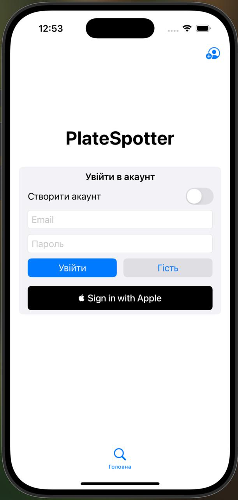
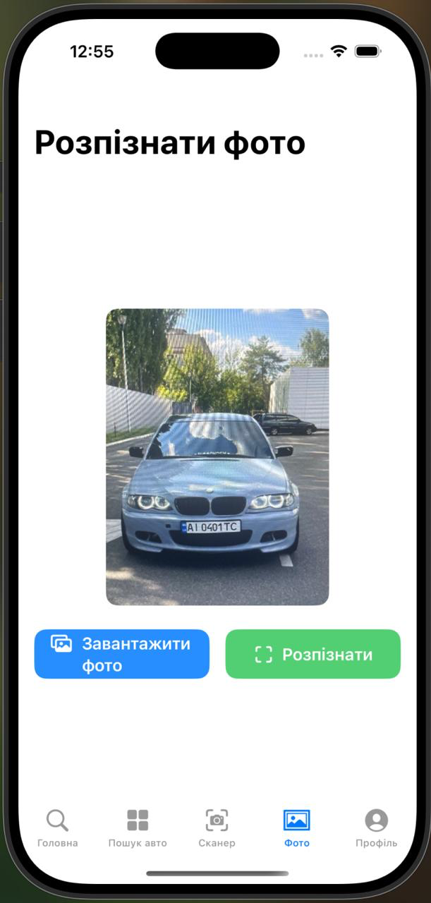
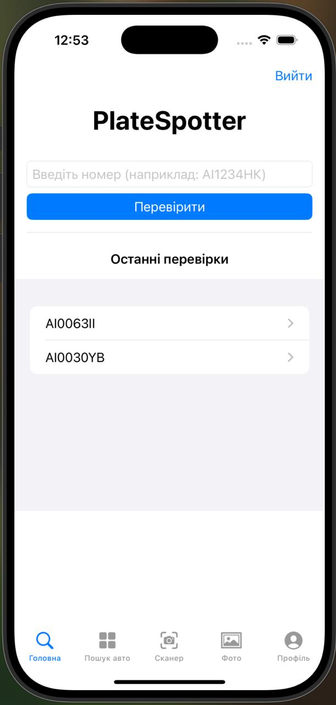
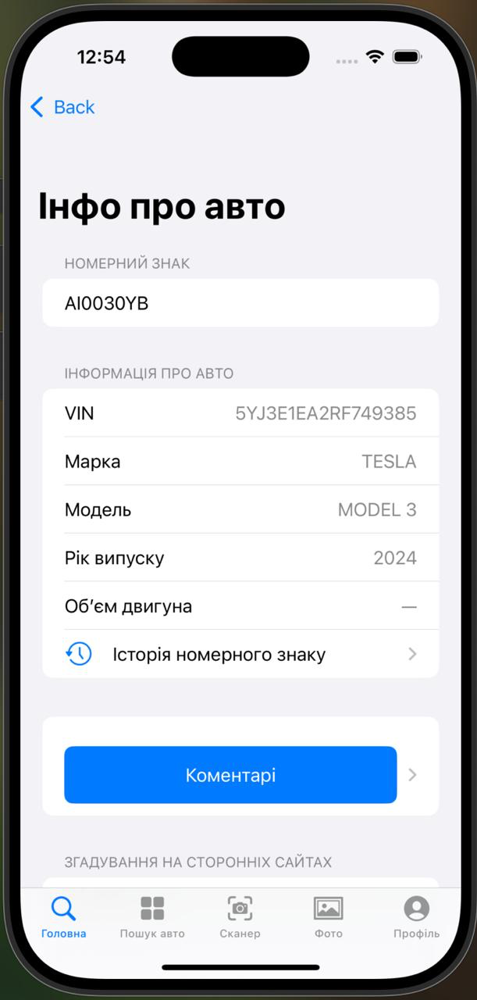
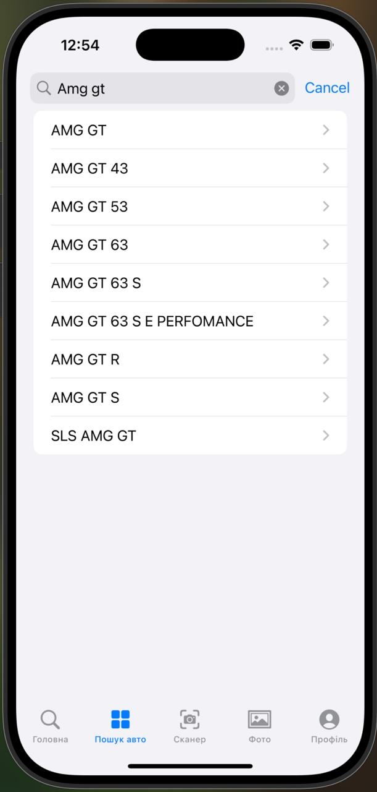

# PlateSpotter

 
 


---

## Опис

**PlateSpotter** — це мобільний застосунок для iOS, який дозволяє розпізнавати українські автомобільні номерні знаки з фотографії або у режимі реального часу, використовуючи камеру телефону.  
Додаток інтегрує **computer vision, OCR** та **API** для пошуку інформації про автомобіль у відкритих державних базах Міністерства цифрової трансформації.

---

## Description

**PlateSpotter** is an iOS mobile app that recognizes Ukrainian license plates in real-time or from photos.  
It integrates **computer vision, OCR**, and **APIs** to fetch detailed car information from public state databases.

---

# Основний функціонал | Key Features

### 1. Авторизація користувачів | User Authentication
Вхід через **Apple, email** або як **гість**.  
Login via **Apple, Google, email** or as **guest**.



---

### 2. Розпізнавання в реальному часі | Real-time Recognition
Використання камери iPhone та **Apple Vision** для детекції номерів.  
Using iPhone camera & **Apple Vision framework** for detection.

STILL IN PROCESS

---

### 3. Завантаження фото | Photo Recognition
Розпізнавання номерів із **зображення галереї**.  
Detect license plates from **gallery images**.



---

### 4. Пошук інформації | Car Info Lookup
Отримання детальної інформації через **бекенд** (FastAPI + PostgreSQL).  
Fetch detailed car info from **backend**.



Пошук переходить в результат 
Results of the search

---

### 5. Історія запитів | Search History
Збереження **останніх 10 перевірених номерів**.  
Store **last 10 recognized plates**.

---

### 6. Обернений пошук | Reverse Search
Пошук номерів зі списку брендів та моделей авто.  
Search plates from list of **car brands/models**.



---

# Технології | Tech Stack

**Frontend (iOS)**  
- SwiftUI  
- AVFoundation  
- Vision (Apple OCR)  

**Backend**  
- FastAPI (Python)  
- PostgreSQL  

---

# Запуск проекту | Getting Started

## iOS App 
1. Відкрити проект у **Xcode**.  
2. Запустити на **iPhone Simulator** або реальному пристрої.  
-
1. Open project in **Xcode**.  
2. Run on **iPhone Simulator** or real device.  

---

## Backend
```bash
git clone https://github.com/KarpovVlad/PlateSpotter.git
cd backend
python -m venv .venv
source .venv/bin/activate
pip install -r requirements.txt
uvicorn main:app --reload
